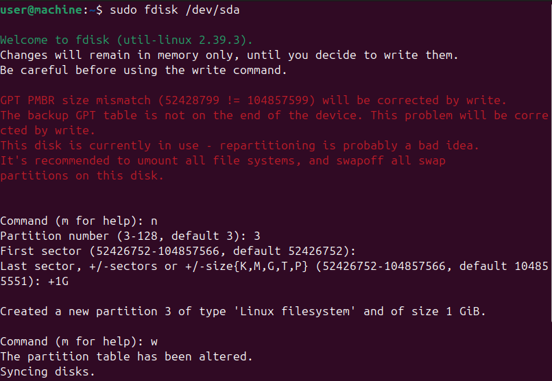
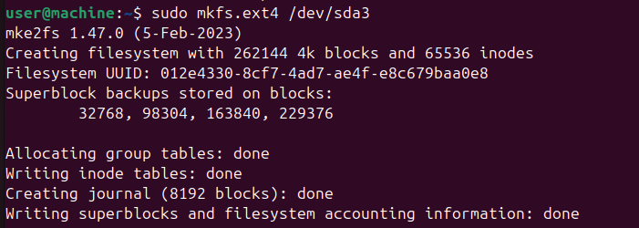
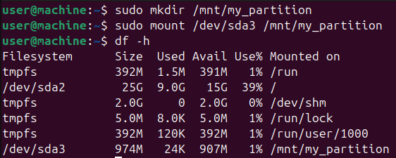

# Лабораторная работа

## Тренировочное задание (в отчет включать не нужно)

Разберем как создать новый раздел с использованием `fdisk`.

### Процесс выполнения

1. Открываем терминал
2. Запускаем `fdisk` на нашем диске:

   ```bash
   sudo fdisk /dev/sda
   ```

   (основной раздел обычно задается как `/dev/sda`. Если это не так, измените эту строку на название вашего диска)
3. Просматриваем текущие разделы (нажмите `p`, затем `Enter`)
4. Создаем новый раздел

   - Для создания раздела нажмите  `n`, затем `Enter`
   - Укажите номер раздела (например, 3)
   - Введите начальный и конечный сектора или размер (например, `+1G` для 1 ГБ).
5. Сохраняем изменения (`w`)
6. Проверяем существование новоиспеченного раздела при помощи команды `lsblk`

## Задание

Создать новый раздел, отформатировать его в файловую систему `ext4` и смонтировать, проверить что раздел смонтирован и конфигурировать его так, чтобы он автоматически монтировался при загрузке системы.

### Как успешно сдать работу?
Создать свой репозиторий из шаблона этого. Как это делается - "Use this template" -> "Create a new repository" и сделайте его public. 

Находясь уже в своем репозитории - создайте новый файл формата .md и там оформляйте отчет. В отчете опишите все шаги которые вы делали, чтобы получить финальный результат работы.

Что вам нужно знать, чтобы успешно защитить работу:

Базовые команды `fdisk`, типы файловых систем, форматирование и монтирование дисков.

## Полезные ресурсы:

1. [Документация по fdisk](https://man7.org/linux/man-pages/man8/fdisk.8.html)
2. [Туториал по fdisk](https://linuxize.com/post/fdisk-command-in-linux/)
3. [Настройка fstab](https://wiki.archlinux.org/title/fstab)
4. [Источник любых знаний](https://google.com) 🐧

---

> ## 🥽 Решение задания

1. Создать новый раздел.
   
2. Отформатировать новый раздел в файловую систему `ext4`.
   
3. Создать точку монтирования.
   ```bash
   sudo mkdir /mnt/my_partition
   ```
4. Смонтировать новый раздел.
   ```bash
   sudo mount /dev/sda3 /mnt/my_partition
   ```
5. Проверить, что раздел смонтирован.
   Введите команду:
   ```bash
   df -h
   ```
   Найдите строку с `/mnt/my_partition`.
   
6. Добавить раздел в `/etc/fstab` для автоматического монтирования при загрузке (Ubuntu делает это за Вас).
   Откройте файл `/etc/fstab` в текстовом редакторе и добавьте строку:
   ```
   /dev/sda3 /mnt/my_partition ext4 defaults 0 2
   ```
   Сохраните изменения и выйдите.
   Поздравляю! Вы успешно смонтировали `ext4` раздел.
